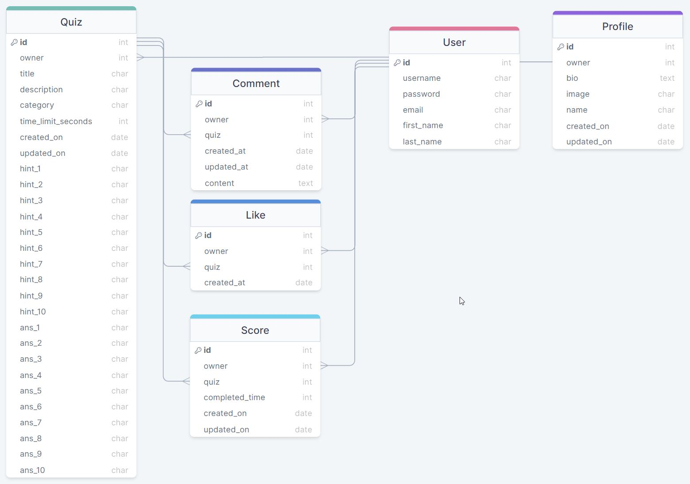
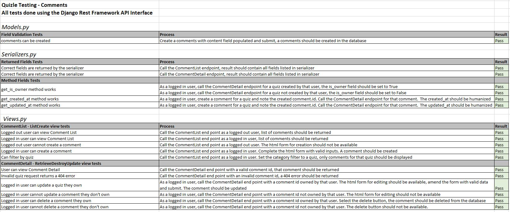
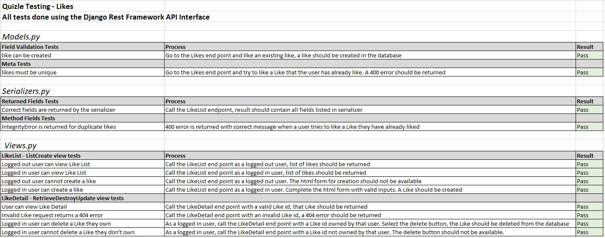
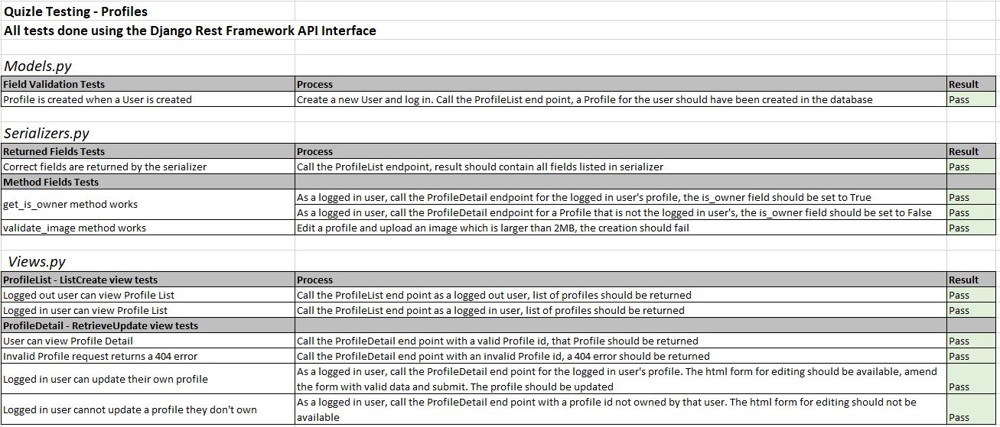
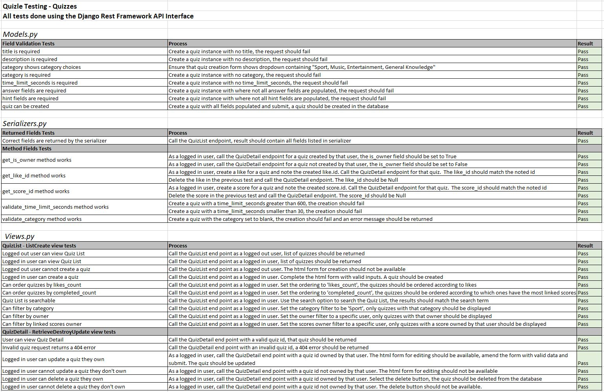
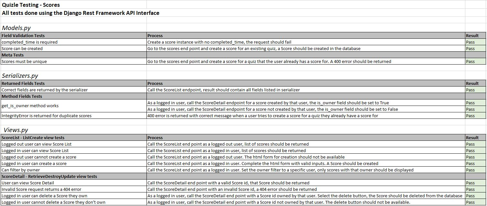

# Quizle - DRF API

Quizle is a quiz website offering quizzes on a variety of topics for users to test their knowledge. This repository makes up the back end aspect of Quizle, consisting of an API built using the Django Rest Framework.

The API allows calls to the Quizle database and enables CRUD functionality for data within the database. The database consists of:

- User model
- Profile model
- Quiz model
- Score model
- Like model
- Comment model

## Live Site

The API for the back end can be access directly [here](https://quizle-drf-api.herokuapp.com/).

The live site for the front end can be found [here](https://quizle-ah.herokuapp.com/).

The repository for the front end can be found [here](https://github.com/adamhatton/quizle).

- [Design](<#design>)
	- [User Stories](<#user-stories>)
	- [Database Schema](<#database-schema>)
	    - [Quiz](<#quiz>)
	    - [Profile](<#profile>)
	    - [Score](<#score>)
	    - [Like](<#like>)
	    - [Comment](<#comment>)
- [Testing](<#testing>)
	- [Manual Testing](<#manual-testing>)
	- [Validation](<#validation>)
- [Technologies](<#technologies>)
	- [Development Technologies](<#development-technologies>)
	- [Testing Technologies](<#testing-technologies>)
- [Deployment](<#deployment>)
	- [Django](<#django>)
	    - [Project Setup](<#project-setup>)
	    - [JWT Tokens](<#jwt-tokens>)
        - [Additional Configuration and Heroku Deployment Preparation](<#additional-configuration-and-heroku-deployment-preparation>)
	- [Heroku](<#heroku>)
- [Credits and Resources](<#credits-and-resources>)
	- [Code](<#code>)
	- [Media](<#media>)

## Design

### User Stories

The API and database was designed to meet the needs of the user stories within the Quizle front end project. These can be seen in front end repository, here: https://github.com/adamhatton/quizle#epics-and-user-stories

### Database Schema

The database was built using the Django Rest Framework and makes use of Django models, serializers, and views. A diagram of the Data Schema can be seen below:

#### Quiz

**Model**

This model stores information about a quiz, including the hints and answers. All of the fields are required.

**Serializer**

The Quiz model has a serializer which adds the following additional fields for when a model instance is returned by the API:

- is_owner: Whether the user making the request is the owner
- profile_id: The profile id of the user that made the quiz
- profile_image: The profile image of the user that made the quiz
- like_id: If the user making the request has liked the quiz, returns the id of that like
- score_id: If the user making the request has completed the quiz, returns the id of the related score object
- score_time: If the user making the request has completed the quiz, returns the completed_time of the related score object
- likes_count: The number of likes that the quiz has received
- completed_count: The number of times the quiz has been completed
- comments_count: The number of comments that have been made on the quiz

**Views**

The Quiz model makes use of the Django generics API views and uses the following:

- A ListCreateAPIView which enables:
	- Users to retrieve a list of Quizzes
	- Users to create a quiz
	- Additional 'count' fields to be added to the serializer (likes_count, completed_count, comments_count)
	- Quizzes to be filtered based on category, owner and score_owner
	- Quizzes to be searched based on username or Quiz Title
	- Quizzes to be ordered based on likes_count and completed_count
- A RetrieveUpdateDestroyAPIView which enables:
	- Users to obtain a single Quiz instance
	- Users to update a single Quiz instance (if they own it)
	- Users to delete a single Quiz instance (if they own it)

#### Profile

**Model**

This model stores information about a user's profile, including their name and profile image. None of the fields are mandatory, and the image field defaults to a user profile icon.

A profile instance is automatically created and linked when a User instance is created.

**Serializer**

The Profile model has a serializer which adds the following additional fields for when a model instance is returned by the API:

- is_owner: Whether the user making the request is the owner
- created_quizzes_count: The number of quizzes the owner of the profile has created
- completed_quizzes_count: The number of quizzes the owner of the profile has completed

In addition, the serializer also contains a function that validates files that are uploaded to make sure they are smaller than 2MB.

**Views**

The Profile model makes use of the Django generics API views and uses the following:

- A ListAPIView which enables:
	- Users to retrieve a list of Profiles
	- Additional 'count' fields to be added to the serializer (created_quizzes_count, completed_quizzes_count)
- A RetrieveUpdateAPIView which enables:
	- Users to obtain a single Profile instance
	- Users to update a single Profile instance (if they own it)

#### Score

**Model**

An instance of this model is created when a user completes a quiz and it contains the user's fastest time for completion. Instances of this model are created automatically on the front end.

A user can only have one score per quiz, so the model prevents additional instances being made for the same user.

**Serializer**

The Score model has a serializer which adds the following additional fields for when a model instance is returned by the API:

- is_owner: Whether the user making the request is the owner
- quiz_title: The title of the quiz the score relates to

In addition, the serializer also contains a function for handling the scenario of multiple scores being made for a user on the same quiz.

**Views**

The Score model makes use of the Django generics API views and uses the following:

- A ListCreateAPIView which enables:
	- Users to retrieve a list of Scores
	- Users to create a Score
	- Scores to be filtered based on the owner
- A RetrieveUpdateDestroyAPIView which enables:
	- Users to obtain a single Score instance
	- Users to update a single Score instance (if they own it)
	- Users to delete a single Score instance (if they own it)

#### Like

**Model**

An instance of this model is created when a user likes a quiz, and it just contains the owner of the like, the quiz they have liked and the time the like was created.

A user can only have one like per quiz, so the model prevents additional instances being made for the same user.

**Serializer**

The Like model has a serializer that just returns the standard model fields when an instance is returned by the API.

In addition, the serializer also contains a function for handling the scenario of multiple Likes being made for a user on the same quiz.

**Views**

The Score model makes use of the Django generics API views and uses the following:

- A ListCreateAPIView which enables:
	- Users to retrieve a list of Likes
	- Users to create a Like
- A RetrieveDestroyAPIView which enables:
	- Users to obtain a single Like instance
	- Users to delete a single Like instance (if they own it)

#### Comment

**Model**

An instance of this model is created when a user posts a comment on a quiz, and it contains the content of the comment, when it was created, who the owner is and which quiz it relates to.

**Serializer**

The Comment model has a serializer which adds the following additional fields for when a model instance is returned by the API:

- is_owner: Whether the user making the request is the owner
- profile_id: The profile id of the user that made the comment
- profile_image: The profile image of the user that made the comment

**Views**

The Comment model makes use of the Django generics API views and uses the following:

- A ListCreateAPIView which enables:
	- Users to retrieve a list of Comments
	- Users to create a Comment
	- Users to filter comments based on the quiz they relate to
- A RetrieveUpdateDestroyAPIView which enables:
	- Users to obtain a single Comment instance
	- Users to update a single Comment instance (if they own it)
	- Users to delete a single Comment instance (if they own it)

## Testing

The testing was broken down into two categories: manual and validation.

### Manual Testing

I manually tested each of the Models along with their serializers and views by using the Django Rest Framework API Interface. I checked the following for each model:

- Field Validation works
- Instances can be created
- Any models with 'Unique' in the Meta do not allow duplicates to be created
- The serializers return all the fields specified
- The Method fields in the serializers work as intended
- The views work and allow users access to the relevant actions (i.e. list, create, update, destroy)
- Users cannot access or write to endpoints that they do not have authorisation for
- Filters, searching, and ordering works

The exact tests I completed can be seen in the screen shots below, or alternatively an excel document containing the information can be found [here](docs/testing/quizle-drfapi-testing.xlsx):

Comment Tests

Like Tests

Profile Tests

Quiz Tests

Score Tests

### Validation

I validated all of my Python code files in the following way:

- Running each file through the [Code Institute Python Linter](https://pep8ci.herokuapp.com/)
- Using flake8 to check for errors directly in GitPod
- Using pycodestyle to check for errors directly in GitPod

After the first pass through the CI Python Linter, there were some minor errors with white space and blank lines, but after I fixed these the second pass returned no errors or warnings.

## Technologies

### Development Technologies

**Languages**
- [Python](https://en.wikipedia.org/wiki/Python_(programming_language))

**Frameworks & Libraries**

- [Cloudinary](https://cloudinary.com/) - used to store and serve files
- [Django](https://www.djangoproject.com/) - used to build the database
- [Django rest auth](https://django-rest-auth.readthedocs.io/en/latest/) - used for implementing account authorisation
- [Django Rest Framework](https://www.django-rest-framework.org/) - used to develop the API that works in conjunction with the database
- [dj-database-url](https://pypi.org/project/dj-database-url/) - used for working with database URLs
- [django-cors-headers](https://pypi.org/project/django-cors-headers/) - used for working with Cross-Origin Resource Sharing
- [django-filter](https://django-filter.readthedocs.io/en/stable/) - used to enable filtering of resources
- [djangorestframework-simplejwt](https://django-rest-framework-simplejwt.readthedocs.io/en/latest/) - used to enable the use of JSON Web Tokens with the API
- [Gunicorn](https://gunicorn.org/) - used for a WSGI HTTP server for the website
- [PyJWT](https://pyjwt.readthedocs.io/en/latest/) - to enable JSON Web Tokens
- [Pillow](https://python-pillow.org/) - imaging library used to enable image fields in the Quiz model
- [psycopg2](https://pypi.org/project/psycopg2/) - a PostgreSQL database adapter

**Tools**

- [DrawSQL](https://drawsql.app/) - used to create a diagram of the Database Schema
- [Gitpod](https://www.gitpod.io/) - used to write and develop the website
- [Git](https://git-scm.com/) – used for version controlling by using the Gitpod terminal to commit to Git, and subsequently pushing to GitHub
- [GitHub](https://github.com/) – used to store the source code for the application
- [Heroku](https://www.heroku.com/) - used to host and deploy the live website
- [Miniwebtool](https://miniwebtool.com/django-secret-key-generator/) - used for generating a Django secret key

### Testing Technologies

- [Code Institute Python Linter](https://pep8ci.herokuapp.com/) - used for linting Python code
- [flake8](https://flake8.pycqa.org/en/latest/) - used for linting Python code
- [pycodestyle](https://pypi.org/project/pycodestyle/) - used for linting Python code

## Deployment

### Django

#### Project Setup

This API is built using the Django Rest Framework (DRF), so having a DRF project set up is necessary for deployment. To set up a DRF project and install the other necessary dependencies that this project uses, follow these steps:

1. Within your development environment, install Django with: `pip install django`. This installs the Django framework
2. For this project, the following dependencies also need to be installed with `pip install <package>`:
- `django-cloudinary-storage`. This allows the site to use Cloudinary for storing and serving files. 
- `Pillow`. This allows ImageFields to be used in the database models
- `djangorestframework`. This installs the Django Rest Framework
- `django-filter`. This allows filtering, searching and sorting of API data
- `dj-rest-auth`. This allows the use of the DRF authorisation and JWT Tokens
- `'dj-rest-auth[with_social]'`. This enables the feature for registering users
- `dj_database_url` (installed using `pip3 install dj_database_url==0.5.0 psycopg2`). A library for working with the databases
- `gunicorn`. A WSGI HTTP server which will be used by the site
- `django-cors-headers`. Enables Django CORS configuration

3. Once all the dependencies are installed, generate a requirements.txt document for them by using: `pip freeze > requirements.txt`. This will store the dependencies of the project in a file called requirements.txt
4. Next, start a new Django project using the command `django-admin startproject <your-project-name> .` (don't leave off the dot at the end as this determines where the project is created).
5. Add your installed apps to the `settings.py` file INSTALLED_APPS variable. The required lines are:
~~~
'cloudinary_storage',
'cloudinary',
'rest_framework',
'django_filters',
'rest_framework.authtoken',
'dj_rest_auth',
'django.contrib.sites',
'allauth',
'allauth.account',
'allauth.socialaccount',
'dj_rest_auth.registration',
'corsheaders',`
~~~
6. To configure cloudinary, the following variables need to be set in settings.py: 
- `CLOUDINARY_STORAGE`: this should be set to your own cloudinary URL. This should be done by creating a `CLOUDINARY_URL` environment variable in an env.py file as follows (the env.py file should be created at the top level of your project):
~~~
import os

os.environ['CLOUDINARY_URL'] = 'cloudinary:<your unique url>
~~~

and importing this into the settings.py file using the following:
~~~
import os
if os.path.exists('env'):
    import env
~~~
 
`CLOUDINARY_STORAGE` can then be set to: `{'CLOUDINARY_URL': os.environ.get('CLOUDINARY_URL')}` which will retrieve the env.py variable in a development environment, but also enable a Config Var to be set in Heroku for deployment to Heroku.

- `MEDIA_URL`: this is set to '/media/' in this project
- `DEFAULT_FILE_STORAGE`: this should be set to 'cloudinary_storage.storage.MediaCloudinaryStorage'
7. For `dj-rest-auth` and `'dj-rest-auth[with_social]'`, ensure that the urls are added to a urls.py file in the 'your app title' directory:
~~~
path('dj-rest-auth/', include('dj_rest_auth.urls')),
path('dj-rest-auth/registration/', include('dj_rest_auth.registration.urls')),
~~~
8. Below the INSTALLED_APPS in settings.py, add: `SITE_ID = 1`
9. Migrations need to be run to set the database up, this can be done with `python3 manage.py migrate`
10. Finally, you can commit and push your changes to GitHub using :
~~~
git add .
git commit -m "initial commit
git push
~~~

#### JWT Tokens

To configure and enable JWT Tokens, complete the following steps:

1. Install the dj-rest-auth package for JWT tokens using `pip install djangorestframework-simplejwt`
2. Create a session authentication value for differentiating between Development and Production environments, this should be added to the env.py file: `os.environ['DEV'] = '1'`
3. Use the session authentication value in settings.py to determine whether to use SessionAuthentication (for in Dev) or JWT Tokens (for in Production) using the following:
~~~
REST_FRAMEWORK = {
    'DEFAULT_AUTHENTICATION_CLASSES': [( 
        'rest_framework.authentication.SessionAuthentication' 
        if 'DEV' in os.environ 
        else 'dj_rest_auth.jwt_auth.JWTCookieAuthentication'
    )]
}
~~~
4. Add `REST_USE_JWT = True` to enable token authentication
5. Add `JWT_AUTH_SECURE = True` to ensure tokens are only sent over HTTPS
6. Give cookie names to the access and refresh tokens using:
~~~
JWT_AUTH_COOKIE = 'my-app-auth'
JWT_AUTH_REFRESH_COOKIE = 'my-refresh-token'
~~~

#### Additional Configuration and Heroku Deployment Preparation

1. Add pagination to the API results by adding the following into the `REST_FRAMEWORK` variable:
~~~
'DEFAULT_PAGINATION_CLASS':
'rest_framework.pagination.PageNumberPagination',
'PAGE_SIZE': 10,
~~~
2. Add date and time formatting into the `REST_FRAMEWORK` variable:
`'DATETIME_FORMAT': '%d %b %Y'`
3. Set the default renderer to be JSON Renderer in the Production environment:
~~~
if 'DEV' not in os.environ:
    REST_FRAMEWORK['DEFAULT_RENDERER_CLASSES'] = [
        'rest_framework.renderers.JSONRenderer'
    ]
~~~
4. Install the PostGres Database using `pip3 install dj_database_url==0.5.0 psycopg2`
5. Import the dj_database_url into settings.py: `import dj_database_url`
6. Set the Dev environment to use the SQLite database and the Production environment to use PostGres with the following:
~~~
DATABASES = {
    'default': ({
        'ENGINE': 'django.db.backends.sqlite3',
        'NAME': BASE_DIR / 'db.sqlite3',
    } if 'DEV' in os.environ else dj_database_url.parse(
        os.environ.get('DATABASE_URL')
    ))
}
~~~
7. Create a Procfile at the top level of your project and include the following:
~~~
release: python manage.py makemigrations && python manage.py migrate

web: gunicorn <your app name>.wsgi
~~~
8. Set the ALLOWED_HOSTS variable as follows (note that the `os.environ.get('ALLOWED_HOST')` will reference a Config Var that is set in Heroku later):
~~~
ALLOWED_HOSTS = [
    os.environ.get('ALLOWED_HOST'),
    'localhost',
]
~~~
9. Add the following line to the top of the MIDDLEWARE list in settings.py:
`'corsheaders.middleware.CorsMiddleware',`
10. Add `import re` to the imports in settings.py
11. Add the following code for CORS configuration:
~~~
if 'CLIENT_ORIGIN' in os.environ:
    CORS_ALLOWED_ORIGINS = [
        os.environ.get('CLIENT_ORIGIN')
    ]

if 'CLIENT_ORIGIN_DEV' in os.environ:
    extracted_url = re.match(
        r'^.+-', os.environ.get('CLIENT_ORIGIN_DEV', ''), re.IGNORECASE
    ).group(0)
    CORS_ALLOWED_ORIGIN_REGEXES = [
        rf"{extracted_url}(eu|us)\d+\w\.gitpod\.io$",
    ]
~~~
12. Allow Cookies using `CORS_ALLOW_CREDENTIALS = True` in settings.py
13. Add `JWT_AUTH_SAMESITE = 'None'` to settings.py
14. Create a new SECRET_KEY in env.py and replace the insecure key in settings.py as follows:
`SECRET_KEY = os.environ.get('SECRET_KEY')`
15. Set DEBUG in settings.py to only be True in Development using:
`DEBUG = 'DEV' in os.environ`
16. Add, commit and push all changes to GitHub.

### Heroku

Once a Django project has been set up and developed, it can be deployed to Heroku using the following steps (this is how this project was deployed):

1.	Ensure that all dependencies are in the requirements.txt file within the project using the python command: `pip freeze > requirements.txt`
2.	Navigate to https://www.heroku.com/ and login
3.	In the top right corner, select ‘New’ then ‘Create new app’
4.	From the ‘Create New App’ screen, enter a unique App name and select Europe, then select ‘Create app’
5.	An app is created and the dashboard is shown, from here navigate to the 'Resources tab'
6.	The Postgres database needs to be connected to the app using an add-on. Search the 'Add-ons' in the Resources tab for 'Heroku Postgres' and select this add-on
7.	On the pop-up for Heroku Postgres select a plan type (for this site 'Hobby Dev - Free' was selected)
    - Note that this project was originally set up using a Heroku Postgres database, but this was migrated to ElephantSQL
    - To deploy in the same way you will need to create an account with ElephantSQL and setup a database. You can then take the database URL that is provided and update the value of the 'DATABASE_URL' in config vars

8.	Navigate to the 'Settings' tab for the app and select to 'Reveal Config Vars', then create the following Config Vars:
- CLOUDINARY_URL: Value for this is the same as CLOUDINARY_URL from your env.py file
- SECRET_KEY: Value for this is the same as SECRET_KEY from your env.py file
- DISABLE_COLLECTSTATIC: 1
- ALLOWED_HOST: Value for this is the url for your Heroku app, for example for this project the value is quizle-drf-api.herokuapp.com
- CLIENT_ORIGIN: Value for this is the url for your deployed Frontend app
- CLIENT_ORIGIN_DEV: Value for this is the url for your Frontend development environment

9.	Navigate to the Deploy tab and from the ‘Deployment Method’ section, select ‘GitHub’
10.	Allow Heroku to connect to GitHub by selecting ‘Connect to GitHub’
11.	Search for the repository by entering the name of the GitHub repository to deploy and selecting search
12.	From the results, choose the relevant repository and select ‘Connect’
13.	To enable automatic deployment of the repository (which will automatically redeploy the project after every push to GitHub), select the ‘Enable Automatic Deploys’ option
14.	To manually deploy the project, select ‘Deploy Branch’ from the Manual Deploy section
15.	When the branch is manually deployed, Heroku will build and deploy the branch. Upon completion, a link to the deployed project will be generated

## Credits and Resources

### Code

- The structure and concepts for creating models/serializers/API views was provided in the back end portion of Code Institute Walkthrough Project 'Moments'. The Profile, Like, and Comment models from this project have been used although some changes have been made.

### Media

- The default profile image was taken from [Pixabay user raphaelsilva](https://pixabay.com/vectors/user-icon-person-personal-about-me-2935527/). Credit has also been given in the model where the image is referenced